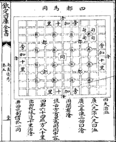

**中文版:** <a href="https://github.com/GoThereGit/EvaHan/blob/main/README_zh.md">点此跳转</a> 

## IMPORTANT NEWS
**Registration Entry:** <a href="https://jsj.top/f/nWLK2R">CLICK ME</a>

## EvaHan 2026

-   <a href="https://github.com/GoThereGit/EvaHan"><b>EvaHan 2026</b></a> is the Fifth International Evaluation of Ancient Chinese
    Information Processing, focusing on OCR tasks for multimodal large
    language models in ancient Chinese.

-   Co-organized with LREC 2026, which will be held from May 11 to 16,
    2026, in Mallorca, Spain.

-   Co-organized with LT4HALA 2026, which will be held in Mallorca, Spain.

-   EvaHan 2026 is organized by Dongbo Wang, Bin Li, Minuxan Feng, Chao
    Xu, Weiguang Qu, Liu Liu, Si Shen.

## Previous Tasks

-   EvaHan 2022

The First Bake-off of Ancient Chinese Automatic Processing was
successfully held in Marseille, France, in 2022, with a focus
on automatic word segmentation and part-of-speech tagging of ancient
Chinese.

-   EvaHan 2023

The Second Bake-off of Ancient Chinese Automatic Processing was
successfully held in Macau, China, in 2023, with a focus on machine
translation of ancient Chinese.

-   EvaHan 2024

The Third Bake-off of Ancient Chinese Automatic Processing was held in
Turin, Italy, in 2024, with a focus on automatic sentence segmentation
and punctuation of ancient Chinese.

-   EvaHan 2025

The Fourth Bake-off of Ancient Chinese Automatic Processing was held in
New Mexico, USA, in 2025, with a focus on named entity recognition in
ancient Chinese.

## Important Dates for EvaHan 2026

-   Registration deadline: **January 30, 2026**

-   Training data release: **January 1, 2026**

-   Test data release: **February 3, 2026**

-   Running results submission: **February 9, 2026**

-   Technical report submission deadline: **February 28, 2026**

-   Notification of acceptance: **March 1, 2026**

-   Camera-ready papers due: **March 10, 2026**

## Participation

To participate in EvaHan 2026, you must complete the following steps:

1. <a href="https://jsj.top/f/nWLK2R">**Registration:**</a>\
   Submit a registration form to officially register your team for the
   task. Registration is open from December 1, 2025, to January 30, 2026.
   Only registered participants will gain access to the training dataset.

2. **Accessing the Training Data:**\
   After completing the registration process, participants will receive
   instructions for downloading the training dataset, which includes
   image--text pairs from ancient Chinese texts for OCR.

3. **Submitting Results and Reports:**\
   Participants must use the provided test data to generate results and
   submit their system outputs and a technical report as per the shared
   task schedule.

For inquiries or to request the registration form, please contact us
at [evahan2026@gmail.com](mailto:evahan2025@gmail.com).

**Data**

The Evahan 2026 dataset comprises three datasets, covering image-text
pairs: plain text images, mixed image-text images, and handwritten
images-text. The data underwent initial automatic annotation, followed
by meticulous correction and refinement by experts in classical Chinese
language and history to ensure the highest quality of the training
materials and gold-standard texts.

● Dataset A （ Printed Texts） consists of data selected from the *Siku Quanshu* (Complete
Library of the Four Treasuries), including classics, history,
philosophy, and literature, as well as various other ancient books.

● Dataset B （Mixed Layouts） contains mixed image-text data selected from the *Siku
Quanshu* and other ancient books.

● Dataset C （Handwritten Texts） includes handwritten ancient books, primarily the Chinese
Buddhist canon, including the Chinese Buddhist canon (TKH) dataset, and the Chinese Buddhist canon (MTH)
dataset.

**Data Format**

All data is presented in image-text pairs and stored in JSON files with multiple encoding formats. The specific format is shown in Table 1.

##  Table 1. Ancient Chinese OCR Corpus Example

| picture | text |
|---------|------|
|   Printed Texts | 欽定四庫全書     史部十一\\n 三呉水考       地理類四{{河渠之屬/}}\\n  提要\\n    {{臣/}}等謹案三呉水考十六卷明張内藴周大\\n    韶仝撰内藴稱呉江生員大韶稱華亭監生\\n    其始末則均未詳也初萬厯四年言官論蘇\\n    松常鎮諸府水利久湮宜及時修濬乞遣御\\n    史一員督其事乃命御史懷安林應訓往應 |
|  Mixed Layouts | 四夫治洫\\n              廣八尺深八尺曰洫\\n              廣二尋深二仞曰澮\\n              同間有澮\\n              註云方百里為同同中容\\n              四都六十四成方八十里\\n              出田稅縁邊十里治澮\\n              井田之制備於一同 |
|  Handwritten Texts | 言卽眼識界若有爲若無爲增語是\\n 菩薩摩訶薩卽耳鼻舌身意識界若\\n 有爲若無爲增語是菩薩摩訶薩善\\n 現汝復觀何義言卽眼識界若有漏\\n 若無漏增語非菩薩摩訶薩卽耳鼻\\n 舌身意識界若有漏若無漏增語非\\n 菩薩摩訶薩耶世尊若眼識界有漏\\n 無漏若耳鼻舌身意識界有漏無漏\\n 尚畢竟不可得性非有故況有眼識\\n 界有漏無漏增語及耳鼻舌身意識\\n 界有漏無漏增語此增語旣非有如\\n 何可言卽眼識界若有漏若無漏增\\n 語是菩薩摩訶薩卽耳鼻舌身意識\\n 界若有漏若無漏增語是菩薩摩訶\\n 鼻...... |

**Training Data**
The training set consists of designated portions of subsets A, B, and C. All training samples are provided in image-text pair format, with text in Traditional Chinese, approximately 5000 image-text pairs per subset. Registered participants will receive the training data via email.

**Test Data**
The test set includes the remaining unseen portions of subsets A, B, and C to ensure comprehensive evaluation of all three challenge types. The data is also provided in image-text pair format, approximately 200-500 image-text pairs per subset. Detailed information and a download link for the test data will be provided to participants before the start of the formal evaluation period.

# Task
This section offers a detailed description of the tasks encompassed in
EvaHan 2026.

**OCR**

In many Chinese language processing systems,OCR is a critical task, often performed in parallel with
other processing functions. The accuracy and speed of OCR directly
determine the overall system\'s performance and user experience in
downstream applications such as document digitization, information
extraction, and intelligent retrieval.

# Evaluation

# Metrics

Prior to the official competition commencement, each participating team may only access the training data. Subsequently, the unlabeled test data will be released on February 3, 2026. Following the completion of evaluations, the labels for the test data will also be published. Tables 2 and 3 provide examples of the scorers' outputs. 

Table 2. Character-Level Recognition Performance of the OCR Module

| Task | Precision| Recall | F1_Score | CER  |  NED |
|------|----------|--------|----------|------|------|
| OCR  |  0.75    | 0.98   |  0.34    | 0.41 | 0.32 |

Table 3. Efficacy of the Layout Analysis Module for Page Segmentation

|         Task         |  mAP@[.5:.95]  |   IoU  |Micro-average F1 |Macro-average F1| 
|----------------------|----------------|--------|-----------------|----------------|
| Page Layout Analysis |      0.88      | 0.79   |     0.56        |     0.71       |

For the three datasets, the evaluation comprises two primary tasks: Task 1 focuses on pure text recognition via OCR, assessing metrics such as CER and precision; Task 2 centers on identifying layout elements in ancient texts, evaluating metrics including mAP and Micro-average F1. Detailed evaluation metrics are presented in Tables 4 and 5.

Table 4. OCR Task Metrics Explanation

# Two Modalities

Each participant can submit results for both modes. In the closed mode,
each team has limited resources. Each team can only use training data
and a pre-trained model. This model is a word embedding pre-trained on a
large Traditional Chinese corpus. No other resources are allowed in the
closed mode.

In the open mode, there are no restrictions on resources, data, or models. Annotated external data, such as processed images or text, may be used. However, each team must disclose all resources, data, and models used in each system in the final report.

# Baselines

As a baseline, we will provide the scores obtained on test set using
[Qwen/Qwen2.5-VL-7B-Instruct(https://www.modelscope.cn/models/Qwen/Qwen2.5-VL-7B-Instruct)](https://www.modelscope.cn/models/Qwen/Qwen2.5-VL-7B-Instruct) or [Xunzi_Qwen2_VL_7B_Instruct (https://huggingface.co/RAY5/Xunzi_Qwen2_VL_7B_Instruct)](https://huggingface.co/RAY5/Xunzi_Qwen2_VL_7B_Instruct)  training on train set without additional
resources.

# How to Participate

Registration time is mentioned above. Participants will be required to
submit their runs and to provide a technical report for the task they
participated in.

## Submitting Runs

Each team can submit runs for two tasks. A run should be produced
according to the closed modality. The second run will be produced
according to the open modality. The closed run is compulsory, while the
open run is optional.

Once the system has produced the results for the task over the test set,
participants have to follow these instructions to complete their
submission:

-   The annotated results should be submitted as three plain text files
    encoded in UTF-8 (four-byte encoding). The specific submission format will be released along with the pre-trained dataset.
-   Final submission format:
    For test sets A, B, and C, corresponding to training sets A, B, and C respectively, submit three corresponding JSON files named "TestA.json", "TestB.json", 
    and "TestC.json" according to the format specified earlier;
    In addition, you need to submit a descriptive document briefly explaining the training method, the model used, and data information.
    Finally, package these four files into a folder, named in the format: ID + Team Leader's Name + Competition Mode.

-   Please submit the annotated test set results via
    [evahan2026@gmail.com](mailto:evahan2025@gmail.com). before February
    6, 2026, 23:59 (UTC+8).

-   Two submissions are allowed before the deadline. However, the final
    score will be based solely on the last submission.

-   Submit your trained code via email so the organizers can reproduce
    the results.

# Writing the Technical Report 

All the reports must:

Technical reports will be included in the proceedings of the **Fifteenth biennial Language Resources and Evaluation Conference (LREC 2026)**, which will take place from May 11 to 16，2026, in Mallorca, Spain. 

Submission is electronic, using the Softconf START conference management system via the link: 
https://softconf.com/lrec2026/main

Submissions should be 4 to 8 pages in length (excluding references and potential Ethics Statements). Submissions should follow the LREC stylesheet, available on the conference website on the Author’s kit page. All templates are also available from this page. 

At the time of submission, authors are offered the opportunity to share related language resources with the community. All repository entries are linked to the LRE Map, which provides metadata for the resource.  

# Participant

-   Researchers interested in ancient book OCR based on machine learning
    and multimodal large models.

# Organizers

-   **Dongbo Wang**, College of Information Management, Nanjing
    Agricultural University, China

-   **Bin Li**, School of Chinese Language and Literature, Nanjing
    Normal University, China

-   **Minxuan Feng**, School of Chinese Language and Literature, Nanjing
    Normal University, China

-   **Chao Xu**, School of Chinese Language and Literature, Nanjing
    Normal University, China

-   **Weiguang Qu**, School of Computer and Electronic Information
    /School of Artificial Intelligence, Nanjing Normal University, China

-   **Liu Liu**, College of Information Management, Nanjing Agricultural
    University, China

-   **Si Shen**, School of Economics and Management, Nanjing University
    of Science and Technology, China

# Student Members

-   **Dongmei Zhu**, College of Information Management, Nanjing
    Agricultural University, China

-   **Jieqiong Li**, College of Information Management, Nanjing
    Agricultural University, China

-  **Ruifeng Wu**,College of Information Management, Nanjing Agricultural
    University, China

-   **Junyi Yang**，College of Information Management, Nanjing Agricultural
    University, China

-   **Zhixing Xu**, School of Chinese Language and Literature, Nanjing
    Normal University, China

-   **Junjie Li**, School of Chinese Language and Literature, Nanjing Normal
    University, China
    
-   **Yue Zhu**, School of Chinese Language and Literature, Nanjing
    Normal University, China
    
-   **Mengting Xu**, School of Chinese Language and Literature, Nanjing
    Normal University, China

# Guiding Units

-- Ancient Books Intelligent Development and Utilization Committee, China Ancient Books Preservation Association

Co-organizing Units (in no particular order):

-- Language Intelligence Committee, Chinese Association for Artificial Intelligence

-- Youth Working Committee, Chinese Information Processing Society of China

-- Language Resources and Computational Humanities Committee, Chinese Society for Ethnic Languages

-- Natural Language Processing Committee, Jiangsu Provincial Artificial Intelligence Society

-- GULIAN (BEIJING) MEDIA TECH CO.,LTD

# Appendix: Selection of Resources

For more information about the EvaHan shared task and the ALP2026
workshop, visit the [official ALP2026
webpage](https://lrec2026.info/).

OCR Model

-   DeepSeek-OCR: <https://www.modelscope.cn/models/deepseek-ai/DeepSeek-OCR>

-   PaddleOCR-VL:
    <https://www.modelscope.cn/models/PaddlePaddle/PaddleOCR-VL>

-   mscoder/duguang-ocr-onnx-v2:
    https://www.modelscope.cn/models/mscoder/duguang-ocr-onnx-v2

-   RapidAI/RapidOCR: https://www.modelscope.cn/models/RapidAI/RapidOCR

-   iic/cv_convnextTiny_ocr-recognition-document_damo:
    https://www.modelscope.cn/models/iic/cv_convnextTiny_ocr-recognition-document_damo

 
