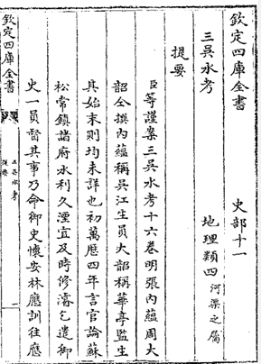
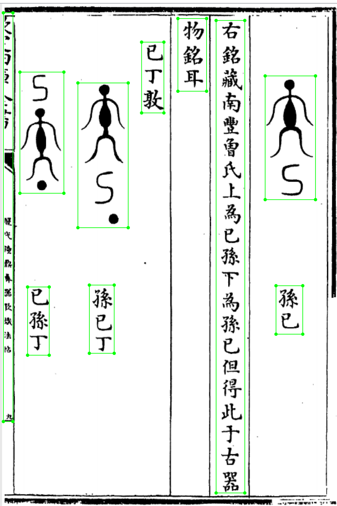
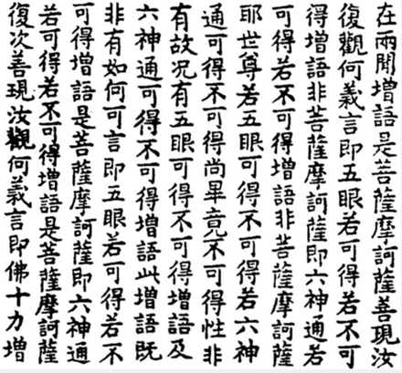
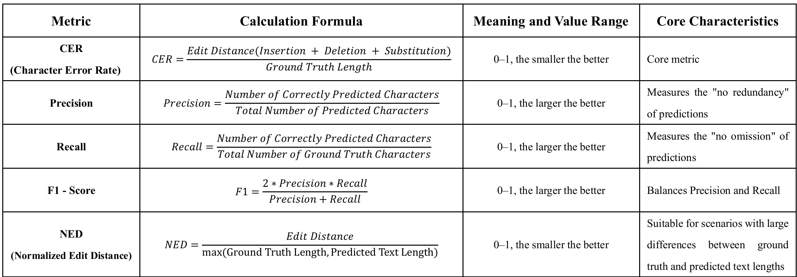
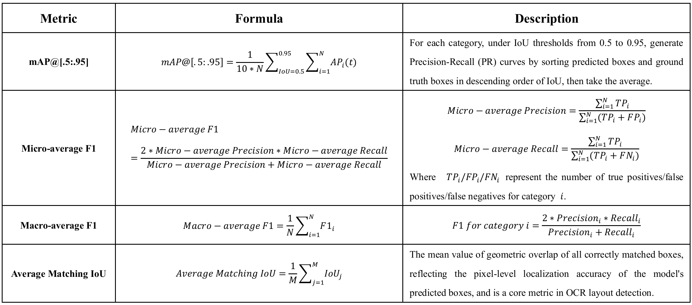
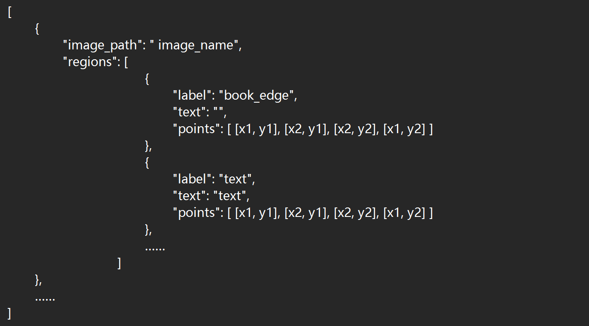

# 欢迎参赛 | EvaHan2026 古籍多模态OCR国际评测

**English Version:** <a href="https://github.com/GoThereGit/EvaHan/blob/main/README_zh.md">CLICK ME</a> 

## 最新消息
评测报名入口：<a href="https://jsj.top/f/nWLK2R">点此跳转</a>

## 背景

中国古代典籍是中华文明最重要的载体之一，对其进行大规模数字化、智能化利用，是数字技术繁盛的当代，传承中华文明的重要方式。然而，光学字符识别（OCR）技术因古籍文本的异体字、残损笔迹等特殊难题，一直以来都是制约古籍文本实现大规模数字化、智能化的瓶颈。近年来，多模态大语言模型的迅猛发展，为突破上述技术瓶颈提供了新的可能。因此，如何科学评估其在复杂古籍图像（印刷体、版刻混排、手写体）上的OCR与版面分析能力，已成为当前领域的前沿课题。

为持续推动中文古籍智能处理技术发展，由南京农业大学、南京师范大学、南京理工大学等多单位联合主办的EvaHan 2026国际评测将于2026年正式开展，评测会议将于5月11日-5月16日在西班牙马略卡岛LREC 2026子会议上举办。这是第五届针对古代汉语语言技术的国际测评，本次测评聚焦于利用大语言模型（LLMs）进行古代汉语OCR识别任务，力图评价大语言模型的实际应用能力。

## 评测简介

光学字符识别（Optical Character Recognition，OCR）是一种将印刷或手写文本的图片转换为机器编码文本的基础技术。OCR的准确率与速率直接决定着系统整体性能，并影响文档数字化、信息提取及智能检索等下游应用的用户体验。然而，古籍文档的排版和布局与现代印刷存在显著差异，这使得海量基于现代文档数据开发的OCR技术及模型，在处理古籍相关图像时往往难以达到理想的识别效果。加之古籍本身存在文字形态复杂、版式多样等诸多特性，古籍OCR识别至今仍是一项颇具挑战的任务。

中国古代典籍承载着中华数千年的文化与历史信息，是传承民族文化基因的核心载体，其自动化处理有助于突破传统人工整理的效率瓶颈与资源限制，实现古籍文献的规模化、数字化存档，推动传统文化的活化利用与广泛传播，让珍贵典籍中的智慧成果更好服务于当代社会。迄今为止，EvaHan已成功举办了四届，有力推动了古籍智能分析技术的发展。

- 2022年（法国马赛）古汉语分词与词性标注国际评测
- 2023年（中国澳门）古汉语机器翻译国际评测
- <a href="https://aclanthology.org/2024.lt4hala-1.27.pdf">2024年</a>（意大利都灵）古汉语自动句读与标点国际评测
- <a href="https://aclanthology.org/2025.alp-1.19.pdf">2025年</a>（美国阿尔伯克基）古汉语命名实体识别国际评测

EvaHan 2026国际评测组织者将会为参赛者提供统一的训练和测试数据集，参赛者则需要提交在测试集上的实验结果，由组织者评估参赛者最终提交的数据的真实性。

2026年，我们将目光转向更具挑战性的古籍多模态OCR任务，首次系统评估大语言模型在真实古籍图像上的端到端识别与版面理解能力。

## 重要时间节点（UTC+8，北京时间）

- 注册开放：2025年12月1日
- 训练数据发布：2026年1月1日
- 注册截止：2026年1月30日
- 测试数据发布：2026年2月3日 23:50 ~~2026年2月1日~~
- 结果提交截止：2026年2月9日 23:50 ~~2026年2月6日~~
- 技术报告提交截止：2026年2月28日
- 录用通知：2026年3月2日  ~~2026年3月1日~~
- 论文终稿提交：2026年3月10日
- 会议时间：2026年5月11-16日（西班牙·马略卡岛）

## 任务说明
本节详细介绍了EvaHan 2026所涵盖的任务。

古代文学作为中国文明的珍贵遗产，主要以手写形式或古老的印刷字体存在。虽然保存形式多样，但这些材料极为脆弱。光学字符识别（OCR）技术使这些纸质或图像化的古籍能够转化为可编辑的数字文本，便于高效的检索、分析和传播。OCR在该领域的应用将显著提升文献利用效率，促进文化遗产的数字保存。此外，它为学者提供了便捷的研究工具，促进古代书籍知识的普及与创新，推动人文社会科学的发展。

任务A：印刷文本识别

古代印刷字体存在典型挑战，如字符变体、布局复杂、字符缺失和污渍，使识别比现代印刷文本更为困难。任务A采用字符错误率（CER，主要指标）、F1分数（字符/单词水平）和归一化编辑距离（NED）作为评估指标。这些指标全面衡量模型在字符准确性、序列完整性和编辑成本方面的性能。该任务旨在加速古代书籍的数字化，提升印刷古代文献自动转录的实用精度和稳健性。

任务B：布局元素分析

任务B侧重于布局元素识别。核心目标是精确识别古代书籍中四个关键元素：文本、图像、书口和印章。该任务选择mAP（平均精度，主要指标）、IoU（交点与并集）和F1分数作为评估指标。这些指标科学地量化了模型在多个维度上的识别效果，包括检测准确率、区域匹配度和综合识别表现。

任务C：手写字符识别

手写古籍的风格高度个性化，存在多重挑战，包括连笔连结、字形变体、笔画省略和修正痕迹等问题。任务C采用字符错误率（CER，主要指标）、F1分数和归一化编辑距离（NED）作为评估指标，全面评估模型在字符准确性、序列一致性和编辑距离方面的表现。该任务旨在突破手写古代文本自动转录的技术瓶颈，为珍贵古代手稿的数字化保存和深入利用提供关键支持。

## 数据

EvaHan 2026数据集包括三类图像文本对：版刻图像、混合图文图像及手写文本图像，经过自动标注及专家修订后形成高质量的训练和测试集。数据来源包括：

- 数据集A（印刷文本）选自《四库全书》里的经史子集。 
- 数据集B（混合版式）包含从《四库全书》及其他古籍中选取的混合图文数据。 
- 数据集C（手写文本）涵盖手写古籍，主要为汉文佛典，包含《汉文佛典（TKH）》数据集与《汉文佛典（MTH）》数据集。

表 1. 数据示例

| 图片 | 数据示例 |
|---------|------|
|   Printed Texts | 欽定四庫全書     史部十一\\n 三呉水考       地理類四{{河渠之屬/}}\\n  提要\\n    {{臣/}}等謹案三呉水考十六卷明張内藴周大\\n    韶仝撰内藴稱呉江生員大韶稱華亭監生\\n    其始末則均未詳也初萬厯四年言官論蘇\\n    松常鎮諸府水利久湮宜及時修濬乞遣御\\n    史一員督其事乃命御史懷安林應訓往應 |
|  Mixed Layouts | {"label": "book_edge", "points": [[2, 14], [17, 14], [17, 655], [2, 655]]}, {"label": "image", "points": [[28, 107], [97, 107], [97, 297], [28, 297]]}, {"label": "image", "points": [[119, 124], [198, 124], [198, 351], [119, 351]]}, {"label": "text", "points": [[219, 60], [254, 60], [254, 171], [219, 171]]}, {"label": "text", "points": [[40, 444], [74, 444], [74, 551], [40, 551]]}, {"label": "text", "points": [[137, 441], [176, 441], [176, 548], [137, 548]]}, {"label": "text", "points": [[276, 23], [321, 23], [321, 137], [276, 137]]}, {"label": "text", "points": [[336, 26], [381, 26], [381, 767], [336, 767]]}, {"label": "image", "points": [[413, 113], [492, 113], [492, 307], [413, 307]]}, {"label": "text", "points": [[430, 442], [472, 442], [472, 518], [430, 518]]} |
|  Handwritten Texts | 言卽眼識界若有爲若無爲增語是\\n 菩薩摩訶薩卽耳鼻舌身意識界若\\n 有爲若無爲增語是菩薩摩訶薩善\\n 現汝復觀何義言卽眼識界若有漏\\n 若無漏增語非菩薩摩訶薩卽耳鼻\\n 舌身意識界若有漏若無漏增語非\\n 菩薩摩訶薩耶世尊若眼識界有漏\\n 無漏若耳鼻舌身意識界有漏無漏\\n 尚畢竟不可得性非有故況有眼識\\n 界有漏無漏增語及耳鼻舌身意識\\n 界有漏無漏增語此增語旣非有如\\n 何可言卽眼識界若有漏若無漏增\\n 語是菩薩摩訶薩卽耳鼻舌身意識\\n 界若有漏若無漏增語是菩薩摩訶\\n 鼻...... |

数据集被分成训练集（约15000组）与测试集（每个子集约200–500组），所有评估数据均采用“图像-文本”对形式，以json文件存储。

## 核心评估维度

- OCR性能：CER(字错率)、准确率（Precision）、召回率（Recall）、F1-Score和NED（归一化编辑距离）
- 版面分析指标：mAP、微平均F1、宏平均F1、IoU

表1. ocr文本识别评测指标

表2. 版面要素识别评测指标

测试数据的详细信息和下载链接，均将在正式评估期开始前提供给参与者。

## 评测方法
在开始评测之前，请仔细阅读以下说明文档！

<a href="https://github.com/GoThereGit/EvaHan/blob/main/EvaHan2026_Dataset_Description.pdf">数据集说明</a>

1、任务A和C的评测：<a href="https://github.com/GoThereGit/EvaHan/blob/main/task_a_c_eva.py">评测代码</a>
- 该脚本要求参考文件和预测文件都必须为JSON数组格式，每个元素包含`image_path`（作为唯一匹配标识符）和`text`字段：

  
- **快速使用**
  - 修改路径：在评测脚本的 `if __name__ == "__main__":` 部分，修改以下变量：`REF_JSON_PATH`（参考数据 JSON 路径）；`PRED_JSON_PATH`（预测数据 JSON 路径）；`OUTPUT_JSON_PATH`（评估报告存储路径）。
  - 运行脚本：`python task_a_c_eva.py`

2、任务B的评测：评测代码
- 脚本要求参考文件和预测文件均采用JSON数组格式，每个元素包含`image_path`（作为唯一匹配标识符）和`regions`字段。在`regions`字段内，还必须包含两个必填字段：`points`和`label`。

  
- **快速使用**
  - 修改路径：在评测脚本的 `if __name__ == "__main__":` 部分，修改以下变量：`PRED_JSON_PATH`（预测数据 JSON 路径）；`GT_JSON_PATH`（参考数据 JSON 路径）。
  - 运行脚本：`python task_b_eva.py`

## 两种参赛模式

每个参赛队伍都可以提交两种模式的成绩。

在**封闭模式**中，每个团队只能使用官方训练数据、两个指定模型（Qwen2.5-VL-7B-Instruct 或 Xunzi_Qwen2_VL_7B_Instruct）或其他传统机器学习模型。请注意，在封闭模式中，参赛团队不能使用其他外部语料库作为训练数据，也不应使用其他大语言模型（考虑到大语言模型通常在庞大数据集上训练，不适合封闭赛道）。

在**开放模式**中，资源、数据或模型没有限制。可以使用带注释的外部数据，如处理后的图像或文本。然而，每个团队必须在最终报告中披露每个系统中使用的所有资源、数据和模型。

## 参赛方式

- 注册：2025年12月1日–2026年1月30日，发送邮件至[evahan2026@gmail.com](mailto:evahan2026@gmail.com)索取并提交注册表。仅已注册队伍可获得训练数据。

- **结果提交**
  - 每队最多可提交三次任务。封闭模式为强制性，开放模式为可选。
  - **提交格式**：数据集A、B和C分别对应训练集A、B和C。对于每一种参赛模式，每个参赛团队必须提交三个对应的JSON文件，格式与所提供训练数据格式相符。
    - json文件命名规则：**TeamID_TestID_runID_modality.json**，如14_TestA_1_open.json，表示编号为14的队伍第一次提交testA的开放模式结果。
    - 此外，在整理好所有JSON文件后，团队必须将它们打包成一个ZIP文件，最终提交时使用命名格式：**TeamID_runID.zip**。例如：11_3.zip表示编号为11的队伍进行第三次提交。
  - **截止时间**：请在2026年2月9日23：50（UTC+8）之前通过 evahan2026@gmail.com 提交带注释的测试集结果。
  - **提交方式**：每个队伍提交时，请使用报名邮箱提交至evahan2026@gmail.com，否组视为无效。
  - 每支队伍在截止日期前最多只能提交三次，最终得分将基于最新的提交。
  - 提交你的模型和代码以供验证。（可选）

- 技术报告：4–5页，<a href="https://aclanthology.org/2024.lt4hala-1.28.pdf">LREC 2026官方模板</a>，通过Softconf START系统提交（https://softconf.com/lrec2026/main）录用论文将正刊收录于LREC 2026会议论文集。

## 主办团队

南京农业大学信息管理学院

- 王东波、刘浏

南京师范大学语言大数据与计算人文研究中心

- 李斌、冯敏萱、许超、曲维光

南京理工大学经济管理学院

- 沈思

## 学生成员

南京农业大学信息管理学院

- 朱冬梅、厉洁琼、刘畅、武瑞峰、杨俊羿

南京师范大学文学院

- 许智星、李俊洁、朱月、徐梦婷

## 联系方式

- 邮箱：[evahan2026@gmail.com](mailto:evahan2026@gmail.com)
- GitHub：https://github.com/GoThereGit/EvaHan

## 指导单位

-- 中国古籍保护协会古籍智能开发与利用专委会

## 协办单位（排名不分先后）

-- 中国人工智能学会语言智能专委会

-- 中文信息学会青年工作委员会

-- 中国民族语言学会语言资源与计算人文专委会

-- 江苏省人工智能学会自然语言处理专委会

-- 中华书局 古联（北京）数字传媒科技有限公司  

## 附录

OCR Models：

- DeepSeek-OCR: https://www.modelscope.cn/models/deepseek-ai/DeepSeek-OCR

- PaddleOCR-VL: https://www.modelscope.cn/models/PaddlePaddle/PaddleOCR-VL

- mscoder/duguang-ocr-onnx-v2: https://www.modelscope.cn/models/mscoder/duguang-ocr-onnx-v2

- RapidAI/RapidOCR: https://www.modelscope.cn/models/RapidAI/RapidOCR

- iic/cv_convnextTiny_ocr-recognition-document_damo: https://www.modelscope.cn/models/iic/cv_convnextTiny_ocr-recognition-document_damo

---

古籍智能，不止于文本，2026，我们一起让千年典籍“开口说话”！更多信息请持续关注“比特人文”公众号，我们将在12月1日正式开启注册通道！

